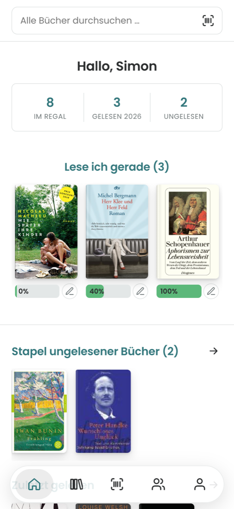
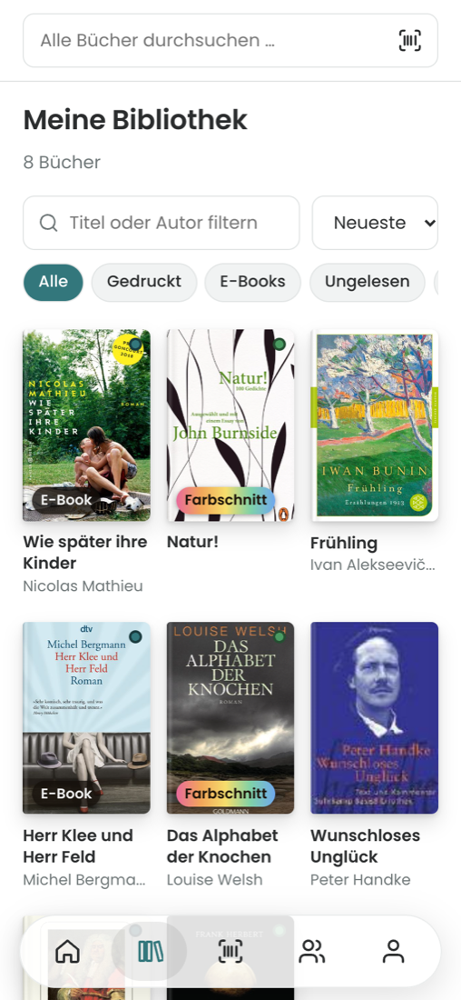
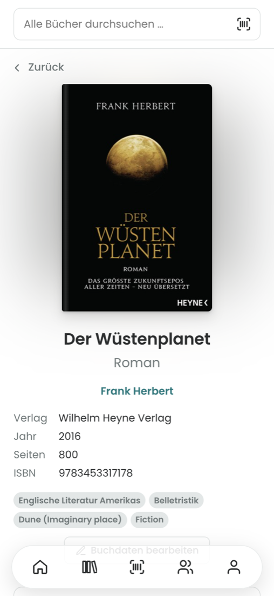
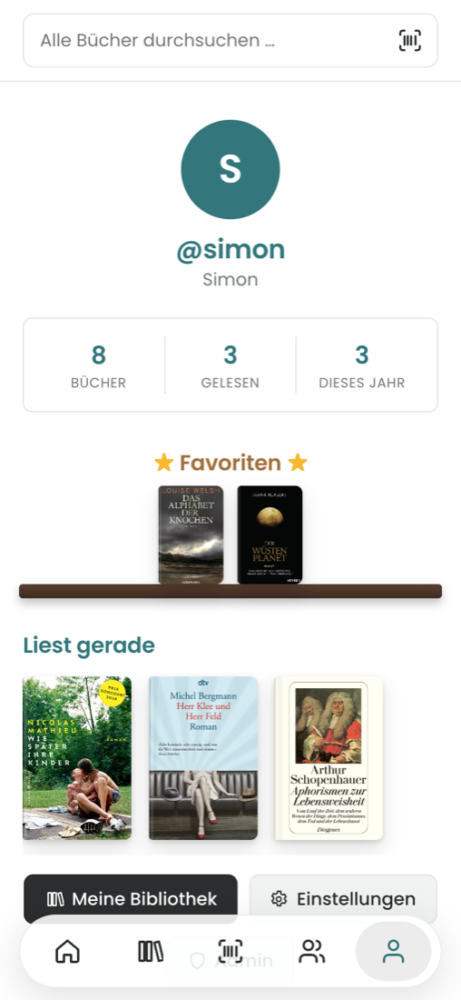

# bookshelv

A small, self-hosted library app for a circle of friends. You scan the barcode on the back of a book, it lands on your shelf with cover and metadata, and from there you can track what you're reading, rate it, and see which of your friends own the same book or thought it was terrible.

I built it for my wife. She reads a lot and tried most of the reading apps out there, but none of them fit: too much social-network noise, tracking everywhere, and nothing that handles the simple question "who did I lend that book to?". So this is the version we actually wanted, running on our own web space.

<p>
  
  
  
  
</p>

## What it does

Adding books is meant to be quick. On a phone you point the camera at the ISBN barcode (or scan a whole shelf in one go, or straight onto your wishlist; without a connection the app remembers the ISBNs and looks them up later), and bookshelv looks it up in the German National Library (DNB) and Open Library. You can also search by title or author, or type everything in by hand if a book isn't in either catalogue. For each copy you note whether it's printed or an e-book, paperback or hardcover, and whether it has sprayed edges.

For each book you keep a reading status (unread, reading, read, did not finish), your progress in pages or percent, and the dates you started and finished. Favourites end up on a little shelf on your profile, and you can pick a top 5 that shows up right under your name. Reading lists work like playlists: put together "Autumn 26" or "Books for the holiday", reorder them, and keep them private or share them with everyone on the instance. Reviews use half stars, can be marked as containing spoilers, and friends can comment on them. The home page shows what you're currently reading, your to-read pile, and what your friends have been up to. The activity feed lists who added, started, finished, rated or listed which book and when, and every book page shows its own history among your friends.

Coming from another app? The importer reads Goodreads and StoryGraph exports directly, and for anything else (Booky, BookBuddy, a spreadsheet) it guesses the columns and lets you correct them. Books you already have are merged instead of duplicated; when a rating, status or date differs you decide case by case, or tell it to always keep bookshelv's value or always take the other app's. Booky exports are recognised directly, including its lists, favourites and the dates you finished books. Every import shows up in an import history and can be undone with one tap, even weeks later. Going the other way, you can export a CSV in Goodreads format, which almost every reading app can import, in StoryGraph format, or as a plain spreadsheet.

It's invite-only. Every user can create invitation links, and there are no e-mail addresses involved, just a username and a password. The admin can block or delete users, reset passwords and clean up the catalogue.

The interface looks like it came out of a typewriter by default (Courier Prime and Special Elite, both served from your own server), or you switch to a plain modern font. There are seven colour themes, from Night and Paper to Ink, Forest and Rosé, and the choice follows you to every device. The interface is available in German and English and works as an installable app (PWA) on Android and iOS.

## Privacy

The browser only ever talks to your own server. Catalogue searches and cover images are fetched server-side and cached locally, so the DNB and Open Library never see your users' IP addresses. There are no external fonts, CDNs, analytics or tracking. The only cookie is the session cookie, so no cookie banner is needed. Users can export all of their data as JSON and delete their account themselves, and each user decides whether others can see their shelf.

If you run an instance in Germany (or anywhere else that wants an imprint), fill in your details under Admin → Instance. bookshelv then generates an imprint and a privacy policy that matches what the app actually does, at `/legal`, linked from the sign-in page and the settings. Your details stay in your database and never end up in the repository.

## How it's built

The backend is Node.js with [Hono](https://hono.dev) and the SQLite driver that ships with Node (`node:sqlite`, Node 22.13 or newer). esbuild bundles it into a single `server.js` with no `node_modules`, which is what makes it easy to run on ordinary shared hosting. The frontend is Svelte 5 with Vite. Barcode scanning uses the browser's BarcodeDetector where available and falls back to zxing-wasm (served from your own server).

It needs very little: around 50 MB of RAM, plus roughly 30 KB of disk per book for the cover.

## Self-hosting

### Docker (home server, Raspberry Pi, VPS)

```bash
git clone https://github.com/sgitaize/bookshelv.git
cd bookshelv
docker compose up -d --build
```

The app listens on port 8080 and keeps everything in `./data` (the database and the covers). That folder is all you need to back up.

On first start, bookshelv writes a one-time setup token so that nobody else can claim the admin account:

```bash
cat data/setup-token.txt
```

Open the app, enter the token and create your admin account. After that you invite people from **Settings → Invite friends**.

You'll want HTTPS in front of it. Browsers only allow camera access over HTTPS, and the session cookie is marked `Secure`. With Caddy, for example:

```caddy
books.example.org {
    reverse_proxy localhost:8080
}
```

If you just want to try it on your LAN without HTTPS, set `BOOKSHELV_INSECURE_COOKIES: "1"` in `docker-compose.yml`. Logging in will work, scanning won't.

### Shared hosting with Node.js (Plesk, e.g. netcup)

Because the backend is a single file without dependencies, you don't need to run `npm install` on the server.

1. Build locally: `npm install && npm run build`. The result is in `dist/`.
2. Upload the contents of `dist/` to a folder on your web space, e.g. `books.example.org/app/`.
3. In Plesk, open the domain's Node.js settings and set:
   - Node.js version: 22 or newer
   - Application root: `/books.example.org/app`
   - Document root: `/books.example.org/app/public`
   - Application startup file: `server.js`
   - Then enable Node.js. There's no need to click "NPM install".
4. Enable a Let's Encrypt certificate for the domain.
5. Read the setup token from `app/data/setup-token.txt` (via SSH or FTP) and open the site.

For updates there's a small deploy script that uploads over SSH and restarts the app. It never touches `data/`:

```bash
cp .env.deploy.example .env.deploy   # host, user, target folder, SSH key – not committed
npm run deploy
```

The script refuses to deploy unless it runs on the machine named in `DEPLOY_FROM_HOST`, on a clean `main` that matches `origin/main`. Whatever is live is therefore always a commit on GitHub, and its hash ends up in `app/deployed-commit.txt`.

### Plain Node

```bash
npm install && npm run build
cd dist && node server.js            # port 3000, data in dist/data
```

### Configuration

| Variable | Default | Meaning |
|---|---|---|
| `PORT` | `3000` | HTTP port (ignored under Passenger) |
| `BOOKSHELV_DATA_DIR` | `./data` | Database, covers, setup token |
| `BOOKSHELV_PUBLIC_DIR` | `./public` | Built frontend |
| `BOOKSHELV_INSECURE_COOKIES` | `0` | `1` allows login over plain http (testing only) |

### Backups

Everything lives in `data/`: `bookshelv.db` and `covers/`. To get a consistent copy of the database while the app is running:

```bash
sqlite3 data/bookshelv.db ".backup data/backup.db"
```

## Development

```bash
npm install
BOOKSHELV_INSECURE_COOKIES=1 npm run dev   # API on :3000, Vite on :5173
```

`server/` holds the backend, `web/` the frontend, `deploy/` the deploy script and `docs/` the design notes. Translations are in `web/src/lib/locales/`. If you add a language, copy `en.ts` and register it in `web/src/lib/i18n.svelte.ts`.

## Roadmap

Done so far: accounts and invitations, the admin area, ISBN scanning and catalogue search, the library with copies (including e-book shops), reading progress, favourites, profiles with pictures, reviews and comments, lending with due dates, an archive for sold or given-away books, a history timeline with filters, a feed of what friends are reading, in-app notifications, a wishlist friends can see, your own covers, a top 5 on the profile, reading lists, an activity feed with each book's history, import from Goodreads, StoryGraph or any CSV with merging, export in Goodreads/StoryGraph format, reading statistics with a yearly wrap-up image you can share, and German/English.

Separate bookshelv instances can be linked, so reviews can be shared and books lent across instances. How that works is described in [docs/FEDERATION.md](docs/FEDERATION.md).

Next up, roughly in this order:

1. Offline mode for the installed app: your data stays available on the device, reading progress and ratings can be changed offline and sync later, and the app shows clearly what isn't possible without a connection (such as adding books from the catalogue).

## Data sources

Book metadata comes from the [Deutsche Nationalbibliothek](https://www.dnb.de/sru) (CC0) and [Open Library](https://openlibrary.org/developers/api). Covers come from Open Library, with the DNB/MVB cover service as a fallback.

## License

[MIT](LICENSE)
